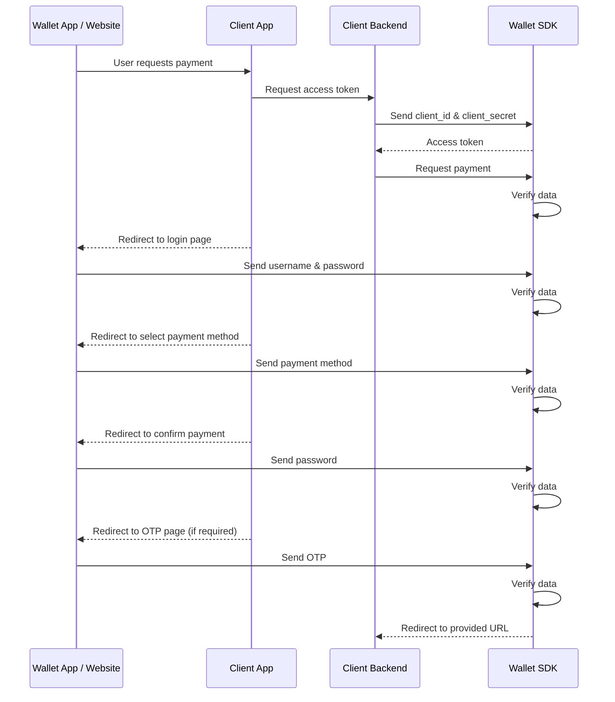

# SDK Payment Processing Architecture

The CellPay Web SDK provides a secure, step-by-step payment workflow that integrates directly into a merchant’s web or backend system. This architecture ensures smooth, authenticated, and traceable transactions between the merchant application, the user, and the CellPay system. 
